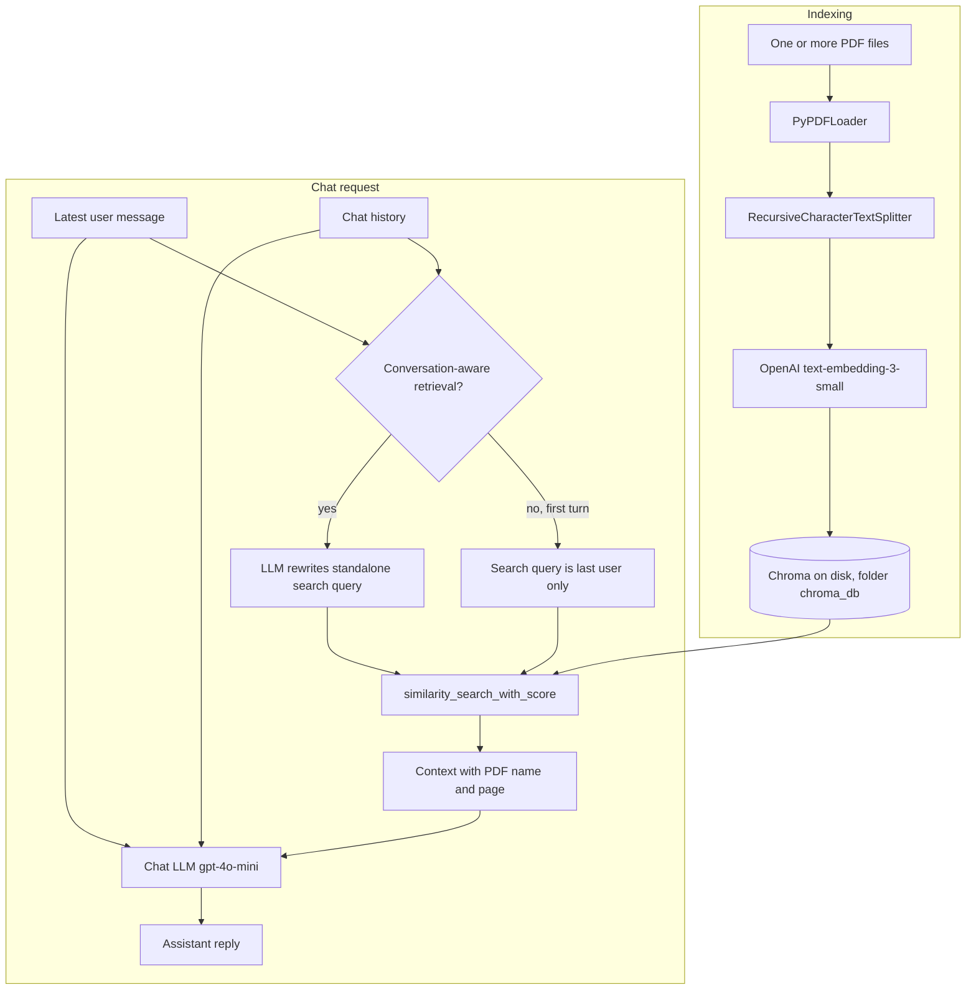

# Book Coach RAG (MVP)

A small **retrieval-augmented** chat app: add **one or many PDFs** into a **shared Chroma index**, then chat with **OpenAI** using **top‑k** retrieved passages as context. **Streamlit** UI; **Chroma** on disk (`chroma_db/`); **LangChain** for ingest and the chat chain. New PDFs **append** to the index; **Reset knowledge base** wipes it. Answers are steered to cite **PDF filename and ~page**, not internal `chunk` ids.

---

## Quick start

1. **Python:** 3.10+ (project tested on **3.14.x**; see `pyproject.toml`, `.python-version`).
2. Create a venv and install deps:

   ```bash
   cd "/path/to/rag test"
   python3 -m venv .venv
   source .venv/bin/activate
   pip install -r requirements.txt
   ```

3. Copy `.env.example` → `.env` and set `OPENAI_API_KEY`.
4. Run the app:

   ```bash
   streamlit run app.py
   ```

5. In the sidebar: upload **PDF(s)** and/or enter **one path per line** → **Add PDF(s) to index** (appends to the shared index). Use **Reset knowledge base** only when you want to delete `chroma_db/` and start over. Then chat.

Re-indexing the **same** file replaces that file's previous chunks (per-file dedupe).

---

## Repository layout

Application code lives in the **`book_coach`** package; **Streamlit** stays at the repo root as **`app.py`** so `streamlit run app.py` is unchanged. Evaluation scripts stay under **`eval/`**.

```
.
├── app.py                      # Streamlit UI (entry point)
├── book_coach/                 # RAG library: ingest, retrieve, answer
│   ├── __init__.py
│   ├── config.py               # Embedding model, Chroma collection, chunk defaults
│   ├── chroma_lifecycle.py     # Close Chroma client + chmod tree (SQLite append/reset)
│   ├── warn_filters.py         # Pydantic v1 UserWarning filter (Python 3.14+)
│   ├── vectorstore_loader.py   # Load persisted Chroma for the app
│   ├── ingest.py               # Append PDFs or reset index; per-chunk `source` metadata
│   └── rag.py                  # Query rewrite, search, guardrail, chat (PDF+page citations)
├── tests/                      # `python -m unittest discover -s tests`
├── eval/
│   ├── run_eval.py             # Single-turn: Recall@k / MRR
│   ├── run_conversation_eval.py
│   ├── run_combined_eval.py    # Retrieval metrics + LLM-as-a-judge
│   ├── judge.py                # Judge rubric + strict JSON parsing
│   ├── chroma_retrieval.py
│   ├── questions.json
│   └── conversation_eval.json
├── requirements.txt
├── pyproject.toml              # Python version + setuptools package discovery
├── .env.example
├── .gitignore
└── .python-version
```

**Generated / local (not usefully tracked in git):** `chroma_db/` (vector index), `.venv/`, `.uploaded_pdfs/` (cached browser uploads).

### RAG architecture (current flow)



| Path | Role |
|------|------|
| `app.py` | Streamlit UI: multi-PDF upload / paths (one per line), **Add PDF(s) to index** (append), **Reset knowledge base**, chunking & retrieval tuning, guardrail, chat + retrieval trace. Closes the in-session Chroma client before disk writes to avoid SQLite lock/readonly errors. |
| `book_coach/rag.py` | Optional **LLM search-query rewrite** when history exists; `similarity_search_with_score`; guardrail; CONTEXT headers use **`[PDF: filename — ~page N]`**; system prompt asks the model to cite **PDF + page** in replies (not `chunk` labels). |
| `book_coach/ingest.py` | **Append** PDFs to the shared index (or create it); **`reset_knowledge_base`** deletes `chroma_db/`; each chunk gets **`source`** = resolved path (basename shown in UI/trace). |
| `book_coach/chroma_lifecycle.py` | **`close_langchain_chroma_client`**, **`ensure_chroma_tree_writable`** — used before append/reset and by ingest. |
| `book_coach/vectorstore_loader.py` | Opens persisted Chroma (fixed **`langchain`** collection name) for the live app. |
| `book_coach/config.py` | Shared constants (`EMBEDDING_MODEL`, Chroma collection name, default chunk size/overlap) — no heavy imports. |
| `book_coach/warn_filters.py` | Suppresses LangChain’s Pydantic v1 **UserWarning** on Python 3.14+. |
| `eval/run_eval.py` | CLI: loads `eval/questions.json`, queries Chroma via **chromadb**, prints **Recall@k** / **MRR**. |
| `eval/chroma_retrieval.py` | Shared Chroma query helpers for eval scripts. |
| `eval/run_conversation_eval.py` | Multi-turn eval: **baseline** vs **rewrite** (`book_coach.rag.build_retrieval_query`); uses `eval/conversation_eval.json`. |
| `eval/run_combined_eval.py` | Combined eval: retrieval metrics + optional app-like answer generation + LLM judge scores; writes row-level JSONL under `eval/results/`. |
| `eval/judge.py` | Judge prompt/rubric and strict parser; deterministic `pass` computed from score thresholds. |

---

## Models & defaults

- **Embeddings:** `text-embedding-3-small` (OpenAI).
- **Chat:** `gpt-4o-mini` (OpenAI).
- **Retrieval:** default top‑**k** = 5 (tunable in UI); retrieved passages are passed to the model as **`[PDF: filename.pdf — ~page N]`** blocks so citations in the answer refer to the **source PDF and page**, not internal `chunk` ids.

---

## Evaluation (retrieval + judge)

Two complementary JSON sets: **single-turn** (does your index answer standalone questions?) and **multi-turn** (does **conversation-aware query rewrite** help vague follow-ups?).

| | **Normal (single-turn)** | **Conversation (multi-turn)** |
|---|--------------------------|----------------------------------|
| **File** | `eval/questions.json` | `eval/conversation_eval.json` |
| **Runner** | `eval/run_eval.py` | `eval/run_conversation_eval.py` |
| **OpenAI calls** | Embeddings only (Chroma query) | Embeddings + **rewrite LLM** for the “rewrite” column |
| **What you label** | One **question** string → **gold_pages** | A **message list** ending in **user** → **gold_pages** for **that final user turn** |

**Shared rule — `gold_pages`:** use **human** PDF page numbers (**first page = 1**). Eval code maps to chunk metadata as `metadata["page"] = human_page - 1` (PyPDFLoader). A **HIT** means at least one top‑**k** chunk’s page is in `gold_pages`.

### Combined eval with LLM-as-a-judge — `eval/run_combined_eval.py`

**Purpose:** run retrieval metrics and answer-quality judging in one command.  
This runner keeps Recall@k/MRR and adds judge scores for the generated answer.

**What it does per row:**

1. Builds the retrieval query (baseline or conversation-aware rewrite).
2. Retrieves top‑k chunks from Chroma.
3. Computes retrieval signals (`HIT/MISS`, `first_gold_rank`).
4. (Optional) Generates an app-like answer from retrieved context.
5. (Optional) Judges that answer with `eval/judge.py`.

**Judge outputs (per row):**

- `groundedness` (1-5)
- `correctness` (1-5)
- `citation_faithfulness` (1-5)
- `overall` (1-5)
- `pass` (deterministic in code: `overall >= 4`, `groundedness >= 4`, `citation_faithfulness >= 3`)
- `reason` (short explanation)

**Run:**

```bash
python eval/run_combined_eval.py --file eval/conversation_eval.json -k 5
python eval/run_combined_eval.py --file eval/conversation_eval.json -k 5 --retrieval-mode hybrid
python eval/run_combined_eval.py --skip-judge --max-rows 2
python eval/run_combined_eval.py --file eval/questions.json --no-rewrite
```

**Outputs:**

- Console: per-row status + aggregate retrieval/judge summaries.
- File: `eval/results/combined_YYYYMMDD_HHMM.jsonl` with row-level details.

**Important:** `eval/questions.json` and `eval/conversation_eval.json` are example datasets.  
Do not treat their output as a benchmark; re-label your own data and re-run for meaningful performance conclusions.

---

### 1. Normal questions — `eval/questions.json`

**Purpose:** Regression test **first-message** retrieval (same path as chat turn 1: no query rewrite).

**Structure:** JSON **array** of objects. Each object:

| Field | Required | Description |
|--------|----------|-------------|
| `id` | optional | Short label in logs (e.g., `q1`). |
| `question` | **yes** | Exact string passed to Chroma as the **only** search query. |
| `gold_pages` | **yes** | Non-empty list of integers = PDF viewer page numbers where the answer should live. |

**Example:**

```json
[
  {
    "id": "q1",
    "question": "What is a PM?",
    "gold_pages": [16]
  }
]
```

**Run:**

```bash
python eval/run_eval.py
python eval/run_eval.py -k 8 --persist chroma_db
python eval/run_eval.py --retrieval-mode hybrid
```

---

### 2. Conversation questions — `eval/conversation_eval.json`

**Purpose:** Compare **baseline** vs **conversation-aware** retrieval on **follow-ups** that are vague without history (“that last part”, “the second type”).

**Structure:** JSON **array** of objects. Each object:

| Field | Required | Description |
|--------|----------|-------------|
| `id` | optional | Short label. |
| `messages` | **yes** | Ordered list of `{ "role": "user" \| "assistant", "content": "..." }`. **Last** item **must** be `user` = the turn you score. Everything before = **chat history** passed into `build_retrieval_query`. |
| `gold_pages` | **yes** | Pages that should be retrieved for the **final user** message (not for earlier turns). |

**Assistant turns:** Optional but recommended. They **mimic** what the bot might say after the first user line so the transcript looks like a real thread and the rewriter has concrete phrases (e.g., “estimation drills”, “case interviews”) to expand pronouns. They do **not** need to match your app’s exact wording.

**Example:**

```json
[
  {
    "id": "conv_estimation_followup",
    "gold_pages": [223, 224, 225],
    "messages": [
      { "role": "user", "content": "I'm prepping for PM interviews." },
      { "role": "assistant", "content": "Many guides cover product sense, behavioral, and estimation drills." },
      { "role": "user", "content": "How should I tackle that last part?" }
    ]
  }
]
```

**How each row is scored:**

- **Baseline:** Chroma search uses **only** the **last** `user` `content` (no rewrite).
- **Rewrite:** Search string = `build_retrieval_query(history, last_user, use_query_rewrite=True)` — same as production when “Conversation-aware retrieval” is on.

**Run:**

```bash
python eval/run_conversation_eval.py
python eval/run_conversation_eval.py -k 8
python eval/run_conversation_eval.py --no-rewrite
python eval/run_conversation_eval.py --retrieval-mode hybrid
```

`--no-rewrite` prints **baseline** summary only (no extra LLM cost).

The sample file reuses **page ranges** aligned to the bundled `questions.json` themes; **re-verify** `gold_pages` against your PDF.

---

### 3. Metrics (both runners)

1. **HIT / MISS (per row)**  
   - **HIT:** At least one top‑**k** chunk has `page` ∈ `gold_pages` (after human→metadata mapping).  
   - **MISS:** Otherwise.  
   - **`first_gold_rank`:** rank 1…k of the first matching chunk, or “-” / omitted if MISS.

2. **Distance `d`** (normal eval MISS lines only)  
   Chroma distance query→chunk (often **L2**); **lower ≈ closer**. Not a probability.

3. **Recall@k**  
   \(\text{Recall@}k = \dfrac{\text{\# HITs}}{\text{\# rows}}\).

4. **MRR**  
   Per row: \(1/r\) if first gold chunk is at rank \(r\), else \(0\); **MRR** = mean over rows.  
   Example (k=5): ranks 4, 1, 1, miss, miss → \((1/4 + 1 + 1 + 0 + 0)/5 = 0.45\).

**Requirements:** `OPENAI_API_KEY` in `.env`, and `chroma_db/` built from the material you are evaluating.

**Multi-PDF index:** `gold_pages` alone does not distinguish which PDF a page belongs to. The bundled eval JSON assumes a **single** main book (or you re-verify pages per document). For strict multi-source scoring you would extend the eval schema (e.g., gold `source` / filename).

---

## Changelog (update when something is finalized)

| Date | Note |
|------|------|
| **2026-04-12** | README added: project map, eval metrics (Recall@k, MRR, distance `d`), gold page convention. Eval JSON files are examples; re-run on your own labeled set for meaningful performance numbers. |
| **2026-04-12** | **Conversation-aware retrieval:** when prior turns exist, `gpt-4o-mini` (temp 0) rewrites a **standalone search query** for embeddings; the chat model still receives the actual latest user message + history. Toggle in Streamlit sidebar; retrieval trace shows **search query used for embedding** vs latest utterance. |
| **2026-04-12** | **Faster Streamlit reruns:** `app.py` avoids importing `book_coach.rag` / full LangChain on every run. Chunk defaults live in `book_coach/config.py`. LangChain loads when you **index**, when an existing **`chroma_db`** is opened, or when you **send a chat message**. The `streamlit` package itself may still take a while to start on Python 3.14—wait for the local URL or use Python 3.12 if startup stays painful. |
| **2026-04-12** | **Multi-turn eval:** `eval/conversation_eval.json` (synthetic dialogs + assistant turns), `eval/run_conversation_eval.py`, `eval/chroma_retrieval.py`; `book_coach.rag.build_retrieval_query()` shared with the app. |
| **2026-04-12** | **Package layout:** RAG logic moved into `book_coach/`; root `embed_config.py`, `ingest.py`, `rag.py`, `vectorstore_loader.py`, `warn_filters.py` removed in favor of the package. `pyproject.toml` declares the package for optional `pip install -e .`. |
| **2026-04-12** | README: evaluation section restructured — comparison table, field tables, and JSON examples for **normal** vs **conversation** eval. |
| **2026-04-11** | **Shared multi-PDF index:** append vs **Reset knowledge base**; `source` metadata; `.uploaded_pdfs/`; **`chroma_lifecycle`** closes Chroma before writes + optional chmod on `chroma_db/` (fixes common SQLite readonly/lock on second PDF). |
| **2026-04-11** | **Answer citations:** CONTEXT uses PDF filename + ~page headers; system prompt instructs the model **not** to cite `chunk` ids in user-facing replies. |
| **2026-04-11** | **Tests:** `tests/test_ingest.py` (`python -m unittest discover -s tests`). |

---

## Troubleshooting

### `attempt to write a readonly database` (Chroma / SQLite)

The index lives under `chroma_db/` as local database files. That error means the process **cannot write** there. Typical causes:

1. **Folder permissions** — from the project root:  
   `chmod -R u+w .`  
   If an old index is stuck: stop Streamlit, then `chmod -R u+w chroma_db` or `rm -rf chroma_db` and index again.
2. **iCloud Desktop/Documents** — projects on a synced Desktop can confuse SQLite locks/permissions. Prefer a folder like `~/dev/rag test` (not under iCloud-synced Desktop), or disable “Desktop & Documents” sync for testing.
3. **Another process** using `chroma_db` — only one writer; quit extra Streamlit/Python terminals.
4. **Open Chroma client while appending** — the app now **closes** the in-session vector store before “Add PDF(s)” / “Reset” so SQLite is not left locked; if you still see this after updating, restart Streamlit once after `chmod -R u+w chroma_db`.

---

## License / scope

Personal MVP / proof of concept; not production-hardened (auth, multi-tenant, etc.).
