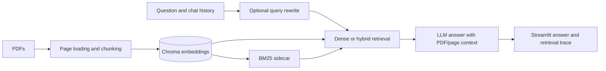

# Book Coach RAG

A PDF question-answering app for interview preparation. Add your reading material, ask a question, and inspect the passages used to answer it, with PDF filenames and page references.

Built as an applied LLM portfolio project: it combines document ingestion, dense and hybrid retrieval, conversation-aware search, and evaluation in a small local application.

## What it demonstrates

- **Multi-PDF ingestion:** append documents to a persistent Chroma index; re-indexing a source path replaces its previous chunks.
- **Retrieval choices:** dense embeddings or BM25 + dense retrieval fused with reciprocal rank fusion (RRF).
- **Follow-up questions:** optionally rewrite a conversational question into a standalone search query using chat history.
- **Inspectable answers:** view the search query, ranked passages, retrieval scores, and PDF/page metadata behind each reply.
- **Evaluation harness:** standalone and conversational retrieval runners, plus optional LLM judging. It is ready for a future labeled corpus; current example labels are not benchmark evidence.

## Run locally

You need Python, an OpenAI API key, and network access. Embedding and chat requests incur API usage charges. PDF text is sent to OpenAI for embedding; retrieved passages and conversation text are used for generation.

Use **Python 3.12.13** (`.python-version`). The package targets Python 3.12, and `requirements.txt` automatically applies the exact dependency versions in `requirements.lock`. Setup validation covers macOS on Intel; other operating systems and architectures have not been verified.

From the cloned repository root:

```bash
python3.12 -m venv .venv
source .venv/bin/activate
python -m pip install -r requirements.txt
python -m pip check
cp .env.example .env
```

Set `OPENAI_API_KEY` in `.env`, then start the app:

```bash
streamlit run app.py
```

On Windows, activate the environment with `.venv\Scripts\Activate.ps1` in PowerShell and copy the environment template with `Copy-Item .env.example .env`.

Run `python --version` after activation to confirm the interpreter. `.python-version` is a version-manager hint; it does not install Python by itself. If you already have a virtual environment, use a new one for a clean setup check. Copy the environment template only if you do not already have a configured `.env`.

See [setup verification and dependency updates](docs/reference.md#setup-verification-and-dependency-updates) for the validation scope and optional editable installation.

## Try a complete example

The repository includes an original, two-page [interview-preparation guide](examples/interview-prep-guide.pdf), with [readable source text](examples/interview-prep-guide.md). It contains no commercial book excerpts or private data.

1. In the sidebar's **Or paths on disk** field, enter `examples/interview-prep-guide.pdf`, then click **Add PDF(s) to index**. Using the path keeps the filename in citations consistent with this walkthrough.
2. Leave **Retrieval mode** on `dense`, **Top-k chunks** at `5`, and **Conversation-aware retrieval** enabled.
3. Ask: **“What four steps does the guide recommend for estimation questions?”**
4. Expand **Retrieval trace (how the answer was grounded)**. Look for the estimation section from `interview-prep-guide.pdf`, page 1, and compare it with the answer.
5. Follow up: **“Can you show me a worked example of that?”** The trace should now show the rewritten search query. The guide's worked example is on page 2.

**Expected content, not a captured model response:** the first answer should describe clarifying scope, breaking the estimate into drivers, stating assumptions and calculating, and checking plausibility. It should reference `interview-prep-guide.pdf`, approximately page 1. The follow-up should explain the fictional cafe estimate: 120 drinks/hour for 2 busy hours plus 40 drinks/hour for 6 quieter hours gives **480 drinks/day**.

Model wording and rankings can vary. This walkthrough is a manual check, not a claim that every generated answer passes. An existing index may contain other PDFs; inspect the source names in the trace. **Reset knowledge base** deletes all indexed documents, so use it only when you intend to start over.

## Local readiness check

This project is ready to run as a single-user local demo. It is not a hosted application: the index and upload cache live on the machine running Streamlit, and one user can reset the shared index.

After completing the walkthrough, use this short manual check before sharing the repository:

1. Stop Streamlit and start it again. Confirm the existing demo index opens without re-indexing.
2. Ask the estimation question again. Confirm the retrieval trace names `interview-prep-guide.pdf` and shows the expected page.
3. Re-add the same demo PDF. The status message should report one replaced file, not a new duplicate.
4. Use **Reset knowledge base** only when you are ready to delete the local demo index; confirm the app returns to the “Add PDFs” state.

The automated checks cover installation, unit tests, evaluation command loading, and the empty-index Streamlit screen. They do not make paid OpenAI calls or verify an existing local index. The manual check above covers those local operating behaviors with your own API key.

## How it works


```mermaid
flowchart LR
    PDF[PDFs] --> Split[Page loading and chunking]
    Split --> DB[(Chroma embeddings)]
    DB --> Sparse[BM25 sidecar]
    Question[Question and chat history] --> Query[Optional query rewrite]
    Query --> Retrieve[Dense or hybrid retrieval]
    DB --> Retrieve
    Sparse --> Retrieve
    Retrieve --> Answer[LLM answer with PDF/page context]
    Answer --> UI[Streamlit answer and retrieval trace]
```

**Stack:** Streamlit, LangChain, Chroma, OpenAI `text-embedding-3-small` and `gpt-4o-mini`, PyPDF, and `rank-bm25`.

Streamlit keeps the demo interactive; on-disk Chroma makes it possible to reopen an index without re-embedding the PDFs. Hybrid retrieval adds keyword matching, while query rewriting addresses vague follow-ups. Whether either improves results depends on the corpus and questions; the repo includes comparison runners to investigate that.

## Tests and future evaluation

Run the ingestion tests:

```bash
python -m unittest discover -s tests
```

The repository includes an evaluation harness for a future labeled corpus: standalone and conversational retrieval runners, dense/hybrid and baseline/rewrite comparisons, and an optional LLM judge. The existing files contain five standalone questions and five synthetic conversation cases about a different book. **Their gold pages do not apply to the bundled demo guide, and they are not published performance claims.**

For your own labeled corpus, the existing runners support dense/hybrid retrieval and baseline/rewrite comparisons. See [evaluation commands, schemas, and judge rubric](docs/reference.md#evaluation-harness-for-a-future-labeled-corpus).

Until there is a representative, manually checked test set, do not use its output to claim retrieval quality or that hybrid retrieval and query rewriting improve results. The historical JSONL files remain as exploratory artifacts only; they are not summarized as project results.

Known limitations, to address when a real test set is available:

- The runners print **Recall@k**, but calculate the proportion of questions with at least one gold-page hit: **Hit Rate@k**.
- Gold matching uses page numbers alone, so it cannot distinguish the same page number in different PDFs.
- LLM judge scores are exploratory and are not independent ground truth; the current judge does not receive conversation history or a reference answer.

## Project map

| Location | Purpose |
| --- | --- |
| `app.py` | Streamlit UI, uploads, settings, and retrieval trace |
| `book_coach/ingest.py` | PDF loading, splitting, add-before-delete replacement, and reset |
| `book_coach/upload_cache.py` | Stable local paths for browser uploads, independent of selection order |
| `book_coach/rag.py` | Query rewriting, retrieval, context formatting, and answers |
| `book_coach/hybrid_retrieval.py` | BM25 sidecar and RRF fusion |
| `book_coach/config.py` | Shared embedding, collection, and chunking defaults |
| `eval/` | Evaluation harness, example labels, and exploratory artifacts |
| `tests/` | Ingestion tests |
| `examples/` | Small PDF and source text for the walkthrough |

[Detailed architecture, settings, troubleshooting, and changelog](docs/reference.md)

## Scope

This is a **single-user local demo**, not a hosted service or production banking system. The index and cached uploads are shared on disk; authentication and per-user isolation are not implemented. The distance guardrail is optional and applies only to dense retrieval. Citations are requested through the prompt, not mechanically verified, and the coach can offer explicitly labeled general advice when the context is insufficient.

The sample guide is original demo material and may be copied or adapted for running and demonstrating this project.
