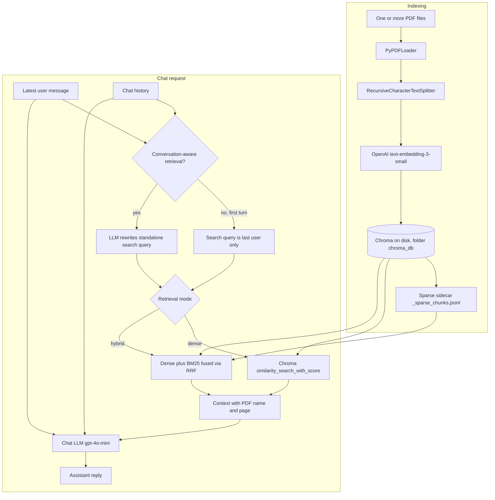

# Implementation and evaluation reference

[Back to the project overview](../README.md)

Commands below run from the repository root. This preserves the existing implementation notes and evaluation instructions; historical environment claims are not a fresh-install guarantee.

## Setup verification and dependency updates

The current setup targets **Python 3.12.13**, with package metadata restricted to Python 3.12. Earlier Python 3.14 references in the changelog describe historical development, not the supported setup path.

`requirements.txt` lists the application's direct dependencies and includes `-c requirements.lock`. The lock is a pip constraints file containing exact direct and transitive runtime versions; it is applied automatically by the README install command. It was generated from a clean environment with pip 26.0. This follows pip's [version-pinning approach to repeatable installs](https://pip.pypa.io/en/stable/topics/repeatable-installs/); it is not a hash-verified or universal cross-platform lock. Platform-specific dependencies on other systems may need additional pins.

Validation on **macOS 26.6.2, Intel x86_64, Python 3.12.13**:

- Clean installation of the dependencies, followed by `python -m pip check`.
- All eight existing ingestion tests pass, including PDF extraction and splitting. Chroma operations in this test suite are mocked.
- All three evaluation entry points load successfully with `--help`.
- Streamlit's missing-key and empty-index screens run through `AppTest` without application exceptions, using an isolated temporary working directory.

The full local readiness sequence (index, answer, restart, replacement, and reset) requires a user-provided OpenAI API key and is documented in the [README](../README.md#local-readiness-check). It is intentionally a manual check because it sends the sample PDF and prompts to OpenAI and may incur charges.

These checks do not verify live OpenAI requests, retrieval quality, an existing database's compatibility, or hosted deployment. They do not modify the working knowledge base. The PDF test emits a parser warning from its deliberately minimal PDF fixture; it still passes.

### Optional editable package installation

Running the app and evaluation commands from the repository root does **not** require installing the project as a package. If you want imports from outside this folder, first install the runtime requirements, then register the package:

```bash
python -m pip install -r requirements.txt
python -m pip install --no-deps -e .
```

`pyproject.toml` handles package discovery and Python compatibility; it does not declare runtime dependencies. Editable installation alone is therefore insufficient. Only `book_coach` is packaged; the Streamlit entry point and evaluation scripts remain in the repository. Build tooling for editable installation is separate from the runtime lock.

### Updating dependencies intentionally

Keep normal installation on the locked versions. To update, use a fresh Python 3.12.13 environment, install the current requirements, then explicitly upgrade the package you intend to change. Run `pip check`, the tests, and the demo checks before capturing a new snapshot:

```bash
python -m pip freeze > requirements.lock
```

Do this from an environment containing only this project's runtime dependencies, before any editable installation or additional development tools. Review the lock diff, retain its environment notes, and update `requirements.txt` bounds if needed. Finally, install `-r requirements.txt` in another clean environment to verify the new snapshot. A package upgrade may also update transitive dependencies; do not regenerate the lock from an unrelated working environment.

### Hybrid retrieval (BM25 + dense)

The app supports **dense** (embeddings only) and **hybrid** retrieval:

- **Dense:** Chroma similarity search (embedding distance).
- **Hybrid:** BM25 keyword retrieval over a local sparse artifact + dense retrieval, fused with **RRF** (reciprocal rank fusion).

After indexing, you should see a sparse sidecar file:

- `chroma_db/_sparse_chunks.jsonl`

It is rebuilt automatically whenever you **Add PDF(s) to index** (it reflects the current Chroma collection).

In the Streamlit sidebar, pick **Retrieval mode** (`dense` vs `hybrid`).  
Note: the **distance guardrail** applies to **dense** mode only (hybrid uses fused ranks/scores, not a single Chroma distance for the fused ordering).

---

## Repository layout

Application code lives in the **`book_coach`** package; **Streamlit** stays at the repo root as **`app.py`** so `streamlit run app.py` is unchanged. Evaluation scripts stay under **`eval/`**.

```
.
├── app.py                      # Streamlit UI (entry point)
├── book_coach/                 # RAG library: ingest, retrieve, answer
│   ├── __init__.py
│   ├── config.py               # Embedding model, Chroma collection, chunk defaults
│   ├── chroma_lifecycle.py     # Close Chroma client + chmod tree (SQLite append/reset)
│   ├── warn_filters.py         # Pydantic v1 UserWarning filter (Python 3.14+)
│   ├── vectorstore_loader.py   # Load persisted Chroma for the app
│   ├── ingest.py               # Append PDFs or reset index; per-chunk `source` metadata
│   ├── hybrid_retrieval.py     # BM25 sparse index rebuild + RRF fusion helpers
│   └── rag.py                  # Query rewrite, search, guardrail, chat (PDF+page citations)
├── tests/                      # `python -m unittest discover -s tests`
├── eval/
│   ├── run_eval.py             # Single-turn: Recall@k / MRR
│   ├── run_conversation_eval.py
│   ├── run_combined_eval.py    # Retrieval metrics + LLM-as-a-judge
│   ├── judge.py                # Judge rubric + strict JSON parsing
│   ├── chroma_retrieval.py
│   ├── questions.json
│   └── conversation_eval.json
├── requirements.txt
├── requirements.lock          # Exact runtime versions, applied as pip constraints
├── pyproject.toml              # Python version + setuptools package discovery
├── .env.example
├── .gitignore
└── .python-version
```

**Generated / local (not usefully tracked in git):** `chroma_db/` (vector index + `chroma_db/_sparse_chunks.jsonl` sparse sidecar), `.venv/`, `.uploaded_pdfs/` (cached browser uploads).

### Upload and replacement behavior

Browser uploads are cached under stable local names, so reordering a multi-file selection does not change a document's indexed source identity. Re-uploading changed content with a unique filename replaces that cached file and follows the normal replacement path. Same-name files in one upload selection are disambiguated with a short content hash.

For a replacement, ingest adds new chunks with fresh IDs before deleting the prior IDs for that source. If the add operation fails, the old chunks remain; the code makes a best-effort attempt to remove any partially written new IDs. A failure while deleting old IDs can leave both old and new chunks, in which case the app reports the error and the index should be rebuilt before relying on it.

### RAG architecture (current flow)



| Path | Role |
|------|------|
| `app.py` | Streamlit UI: multi-PDF upload / paths (one per line), **Add PDF(s) to index** (append), **Reset knowledge base**, chunking & retrieval tuning, **retrieval mode** (`dense`/`hybrid`), guardrail, chat + retrieval trace. Closes the in-session Chroma client before disk writes to avoid SQLite lock/readonly errors. |
| `book_coach/rag.py` | Optional **LLM search-query rewrite** when history exists; dense `similarity_search_with_score` or hybrid fusion; guardrail (dense-only); CONTEXT headers use **`[PDF: filename — ~page N]`**; system prompt asks the model to cite **PDF + page** in replies (not `chunk` labels). |
| `book_coach/ingest.py` | **Append** PDFs to the shared index (or create it); **`reset_knowledge_base`** deletes `chroma_db/`; each chunk gets **`source`** = resolved path (basename shown in UI/trace). Rebuilds `chroma_db/_sparse_chunks.jsonl` after writes. |
| `book_coach/hybrid_retrieval.py` | Rebuild sparse JSONL from Chroma + BM25 retrieval + RRF fusion helpers used by `rag.py` (app) and `eval/chroma_retrieval.py` (eval). |
| `book_coach/chroma_lifecycle.py` | **`close_langchain_chroma_client`**, **`ensure_chroma_tree_writable`** — used before append/reset and by ingest. |
| `book_coach/vectorstore_loader.py` | Opens persisted Chroma (fixed **`langchain`** collection name) for the live app. |
| `book_coach/config.py` | Shared constants (`EMBEDDING_MODEL`, Chroma collection name, default chunk size/overlap) — no heavy imports. |
| `book_coach/warn_filters.py` | Suppresses LangChain’s Pydantic v1 **UserWarning** on Python 3.14+. |
| `eval/run_eval.py` | CLI: loads `eval/questions.json`, runs **dense or hybrid** retrieval via `eval/chroma_retrieval.py`, prints **Recall@k** / **MRR**. |
| `eval/chroma_retrieval.py` | Shared retrieval helpers for eval scripts: Chroma dense queries, BM25 sparse queries, and **RRF** hybrid fusion. |
| `eval/run_conversation_eval.py` | Multi-turn eval: **baseline** vs **rewrite** (`book_coach.rag.build_retrieval_query`); uses `eval/conversation_eval.json`. |
| `eval/run_combined_eval.py` | Combined eval: retrieval metrics + optional app-like answer generation + LLM judge scores; supports `--retrieval-mode`; writes row-level JSONL under `eval/results/`. |
| `eval/judge.py` | Judge prompt/rubric and strict parser; deterministic `pass` computed from score thresholds. |

---

## Models & defaults

- **Embeddings:** `text-embedding-3-small` (OpenAI).
- **Chat:** `gpt-4o-mini` (OpenAI).
- **Retrieval:** default top‑**k** = 5 (tunable in UI); **mode** can be `dense` or `hybrid` (sidebar in the app, `--retrieval-mode` in eval scripts). Retrieved passages are passed to the model as **`[PDF: filename.pdf — ~page N]`** blocks so citations in the answer refer to the **source PDF and page**, not internal `chunk` ids.

---

## Evaluation harness (for a future labeled corpus)

The evaluation code is included so the project can be assessed on a representative, manually checked corpus when one is available. The committed question files are small illustrative examples for a different source document; they do not validate the bundled demo guide or establish a retrieval improvement.

Use the runners to compare one change at a time on the same corpus, labels, settings, and model versions. Do not publish current example-run scores as benchmark results. The historical JSONL files under `eval/results/` are exploratory artifacts, not comparison evidence.

When a real test set is ready, record the source-document identifier or hash, index and chunking settings, retrieval mode/RRF settings, models, prompt revision, application commit, and run time alongside results. For conversational judging, supply the relevant history and a reference answer or acceptance criteria.

Two complementary JSON sets: **single-turn** (does your index answer standalone questions?) and **multi-turn** (does **conversation-aware query rewrite** help vague follow-ups?).

| | **Normal (single-turn)** | **Conversation (multi-turn)** |
|---|--------------------------|----------------------------------|
| **File** | `eval/questions.json` | `eval/conversation_eval.json` |
| **Runner** | `eval/run_eval.py` | `eval/run_conversation_eval.py` |
| **Retrieval mode** | `--retrieval-mode dense` (default) or `hybrid` | `--retrieval-mode dense` (default) or `hybrid` |
| **OpenAI calls** | Embeddings for Chroma dense retrieval (hybrid still uses embeddings for the dense leg) | Embeddings for Chroma dense retrieval + **rewrite LLM** for the “rewrite” column |
| **What you label** | One **question** string → **gold_pages** | A **message list** ending in **user** → **gold_pages** for **that final user turn** |

**Shared rule — `gold_pages`:** use **human** PDF page numbers (**first page = 1**). Eval code maps to chunk metadata as `metadata["page"] = human_page - 1` (PyPDFLoader). A **HIT** means at least one top‑**k** chunk’s page is in `gold_pages`.

### Combined eval with LLM-as-a-judge — `eval/run_combined_eval.py`

**Purpose:** run retrieval metrics and answer-quality judging in one command.  
This runner keeps Recall@k/MRR and adds judge scores for the generated answer.

**What it does per row:**

1. Builds the retrieval query (baseline or conversation-aware rewrite).
2. Retrieves top‑k chunks using `--retrieval-mode` (`dense` uses Chroma distances; `hybrid` uses BM25 + dense fused via RRF).
3. Computes retrieval signals (`HIT/MISS`, `first_gold_rank`).
4. (Optional) Generates an app-like answer from retrieved context.
5. (Optional) Judges that answer with `eval/judge.py`.

**Judge outputs (per row):**

- `groundedness` (1-5)
- `correctness` (1-5)
- `citation_faithfulness` (1-5)
- `overall` (1-5)
- `pass` (deterministic in code: `overall >= 4`, `groundedness >= 4`, `citation_faithfulness >= 3`)
- `reason` (short explanation)

**Run:**

```bash
python eval/run_combined_eval.py --file eval/conversation_eval.json -k 5
python eval/run_combined_eval.py --file eval/conversation_eval.json -k 5 --retrieval-mode hybrid
python eval/run_combined_eval.py --skip-judge --max-rows 2
python eval/run_combined_eval.py --file eval/questions.json --no-rewrite
```

**Outputs:**

- Console: per-row status + aggregate retrieval/judge summaries.
- File: `eval/results/combined_YYYYMMDD_HHMM.jsonl` with row-level details (includes `retrieval_mode` and score fields; hybrid runs store fused **RRF** scores in `retrieved_top_scores`).

**Important:** `eval/questions.json` and `eval/conversation_eval.json` are example datasets.  
Do not treat their output as a benchmark; re-label your own data and re-run for meaningful performance conclusions.

---

### 1. Normal questions — `eval/questions.json`

**Purpose:** Regression test **first-message** retrieval (same path as chat turn 1: no query rewrite).

**Structure:** JSON **array** of objects. Each object:

| Field | Required | Description |
|--------|----------|-------------|
| `id` | optional | Short label in logs (e.g., `q1`). |
| `question` | **yes** | Exact string passed to Chroma as the **only** search query. |
| `gold_pages` | **yes** | Non-empty list of integers = PDF viewer page numbers where the answer should live. |

**Example:**

```json
[
  {
    "id": "q1",
    "question": "What is a PM?",
    "gold_pages": [16]
  }
]
```

**Run:**

```bash
python eval/run_eval.py
python eval/run_eval.py -k 8 --persist chroma_db
python eval/run_eval.py --retrieval-mode hybrid
```

---

### 2. Conversation questions — `eval/conversation_eval.json`

**Purpose:** Compare **baseline** vs **conversation-aware** retrieval on **follow-ups** that are vague without history (“that last part”, “the second type”).

**Structure:** JSON **array** of objects. Each object:

| Field | Required | Description |
|--------|----------|-------------|
| `id` | optional | Short label. |
| `messages` | **yes** | Ordered list of `{ "role": "user" \| "assistant", "content": "..." }`. **Last** item **must** be `user` = the turn you score. Everything before = **chat history** passed into `build_retrieval_query`. |
| `gold_pages` | **yes** | Pages that should be retrieved for the **final user** message (not for earlier turns). |

**Assistant turns:** Optional but recommended. They **mimic** what the bot might say after the first user line so the transcript looks like a real thread and the rewriter has concrete phrases (e.g., “estimation drills”, “case interviews”) to expand pronouns. They do **not** need to match your app’s exact wording.

**Example:**

```json
[
  {
    "id": "conv_estimation_followup",
    "gold_pages": [223, 224, 225],
    "messages": [
      { "role": "user", "content": "I'm prepping for PM interviews." },
      { "role": "assistant", "content": "Many guides cover product sense, behavioral, and estimation drills." },
      { "role": "user", "content": "How should I tackle that last part?" }
    ]
  }
]
```

**How each row is scored:**

- **Baseline:** Chroma search uses **only** the **last** `user` `content` (no rewrite).
- **Rewrite:** Search string = `build_retrieval_query(history, last_user, use_query_rewrite=True)` — same as production when “Conversation-aware retrieval” is on.

**Run:**

```bash
python eval/run_conversation_eval.py
python eval/run_conversation_eval.py -k 8
python eval/run_conversation_eval.py --no-rewrite
python eval/run_conversation_eval.py --retrieval-mode hybrid
```

`--no-rewrite` prints **baseline** summary only (no extra LLM cost).

The sample file reuses **page ranges** aligned to the bundled `questions.json` themes; **re-verify** `gold_pages` against your PDF.

---

### 3. Metrics (both runners)

1. **HIT / MISS (per row)**  
   - **HIT:** At least one top‑**k** chunk has `page` ∈ `gold_pages` (after human→metadata mapping).  
   - **MISS:** Otherwise.  
   - **`first_gold_rank`:** rank 1…k of the first matching chunk, or “-” / omitted if MISS.

2. **Distance `d`** (normal eval MISS lines only)  
   Chroma distance query→chunk (often **L2**); **lower ≈ closer**. Not a probability.  
   In **`--retrieval-mode hybrid`**, the per-chunk score printed on MISS lines is an **RRF fusion score** (higher is better), not a Chroma distance.

3. **Recall@k**  
   \(\text{Recall@}k = \dfrac{\text{\# HITs}}{\text{\# rows}}\).

4. **MRR**  
   Per row: \(1/r\) if first gold chunk is at rank \(r\), else \(0\); **MRR** = mean over rows.  
   Example (k=5): ranks 4, 1, 1, miss, miss → \((1/4 + 1 + 1 + 0 + 0)/5 = 0.45\).

**Requirements:** `OPENAI_API_KEY` in `.env`, and `chroma_db/` built from the material you are evaluating.

**Multi-PDF index:** `gold_pages` alone does not distinguish which PDF a page belongs to. The bundled eval JSON assumes a **single** main book (or you re-verify pages per document). For strict multi-source scoring you would extend the eval schema (e.g., gold `source` / filename).

---

## Changelog (update when something is finalized)

| Date | Note |
|------|------|
| **2026-04-14** | **Hybrid retrieval + eval parity:** BM25 sparse sidecar `chroma_db/_sparse_chunks.jsonl`, RRF fusion in `book_coach/hybrid_retrieval.py`, Streamlit **Retrieval mode** toggle, and `--retrieval-mode {dense,hybrid}` for `eval/run_eval.py`, `eval/run_conversation_eval.py`, and `eval/run_combined_eval.py`. |
| **2026-04-12** | README added: project map, eval metrics (Recall@k, MRR, distance `d`), gold page convention. Eval JSON files are examples; re-run on your own labeled set for meaningful performance numbers. |
| **2026-04-12** | **Conversation-aware retrieval:** when prior turns exist, `gpt-4o-mini` (temp 0) rewrites a **standalone search query** for embeddings; the chat model still receives the actual latest user message + history. Toggle in Streamlit sidebar; retrieval trace shows **search query used for embedding** vs latest utterance. |
| **2026-04-12** | **Faster Streamlit reruns:** `app.py` avoids importing `book_coach.rag` / full LangChain on every run. Chunk defaults live in `book_coach/config.py`. LangChain loads when you **index**, when an existing **`chroma_db`** is opened, or when you **send a chat message**. The `streamlit` package itself may still take a while to start on Python 3.14—wait for the local URL or use Python 3.12 if startup stays painful. |
| **2026-04-12** | **Multi-turn eval:** `eval/conversation_eval.json` (synthetic dialogs + assistant turns), `eval/run_conversation_eval.py`, `eval/chroma_retrieval.py`; `book_coach.rag.build_retrieval_query()` shared with the app. |
| **2026-04-12** | **Package layout:** RAG logic moved into `book_coach/`; root `embed_config.py`, `ingest.py`, `rag.py`, `vectorstore_loader.py`, `warn_filters.py` removed in favor of the package. `pyproject.toml` declares the package for optional `pip install -e .`. |
| **2026-04-12** | README: evaluation section restructured — comparison table, field tables, and JSON examples for **normal** vs **conversation** eval. |
| **2026-04-11** | **Shared multi-PDF index:** append vs **Reset knowledge base**; `source` metadata; `.uploaded_pdfs/`; **`chroma_lifecycle`** closes Chroma before writes + optional chmod on `chroma_db/` (fixes common SQLite readonly/lock on second PDF). |
| **2026-04-11** | **Answer citations:** CONTEXT uses PDF filename + ~page headers; system prompt instructs the model **not** to cite `chunk` ids in user-facing replies. |
| **2026-04-11** | **Tests:** `tests/test_ingest.py` (`python -m unittest discover -s tests`). |

---

## Troubleshooting

### `attempt to write a readonly database` (Chroma / SQLite)

The index lives under `chroma_db/` as local database files. That error means the process **cannot write** there. Typical causes:

1. **Folder permissions** — from the project root:  
   `chmod -R u+w .`  
   If an old index is stuck: stop Streamlit, then `chmod -R u+w chroma_db` or `rm -rf chroma_db` and index again.
2. **iCloud Desktop/Documents** — projects on a synced Desktop can confuse SQLite locks/permissions. Prefer a folder like `~/dev/rag test` (not under iCloud-synced Desktop), or disable “Desktop & Documents” sync for testing.
3. **Another process** using `chroma_db` — only one writer; quit extra Streamlit/Python terminals.
4. **Open Chroma client while appending** — the app now **closes** the in-session vector store before “Add PDF(s)” / “Reset” so SQLite is not left locked; if you still see this after updating, restart Streamlit once after `chmod -R u+w chroma_db`.

---

## License / scope

Personal MVP / proof of concept; not production-hardened (auth, multi-tenant, etc.).
